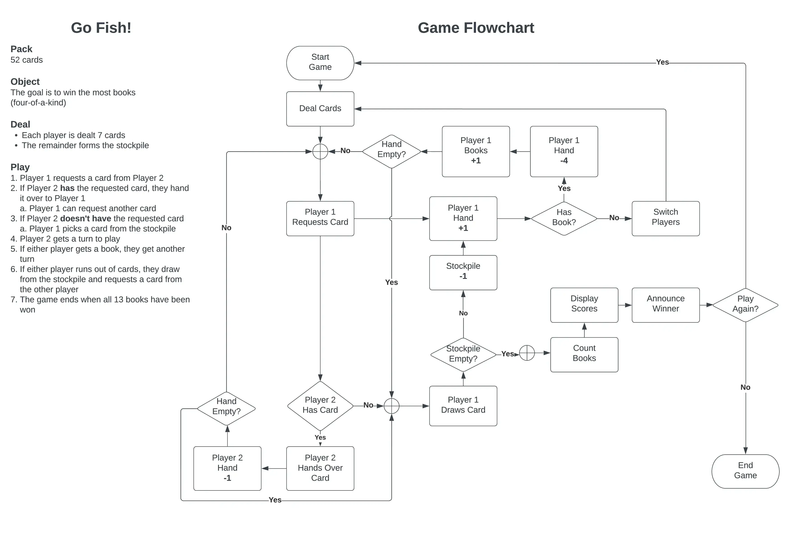
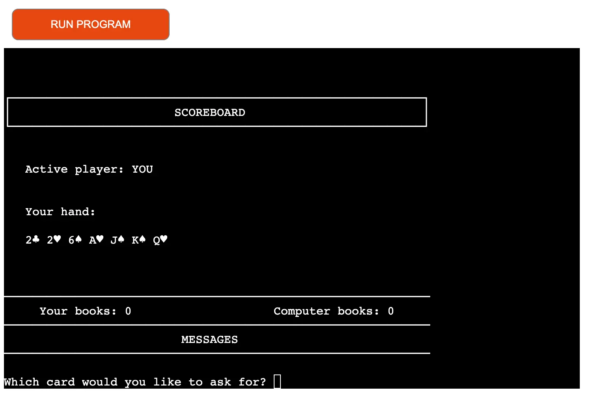
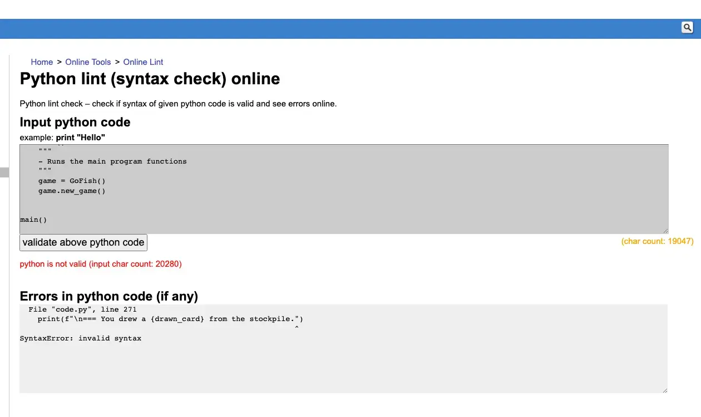
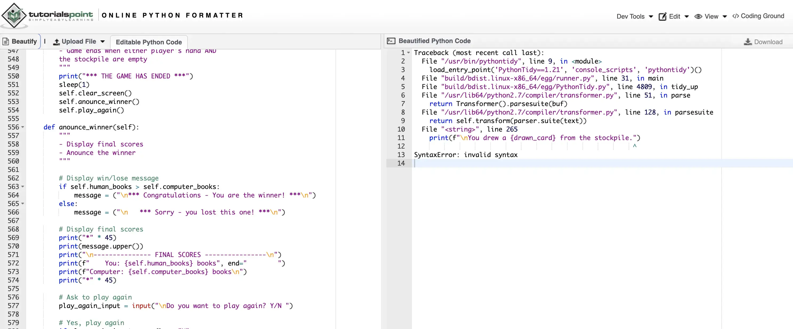
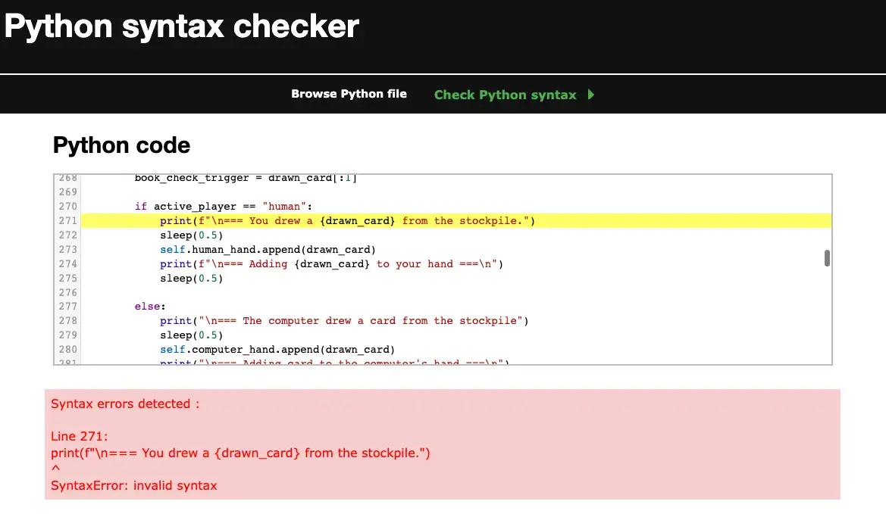

# Go Fish!

## Diploma in Full Stack Software Development - Portfolio Project 

<!-- Mockup Image -->

**[Click here to view the live project.](https://pp3-go-fish.herokuapp.com/)**

Go Fish! is a terminal-based card game which is aimed at children aged 6+.

## UX
My aim was to create a game which is fun to play, yet simple to manipulate using text inputs only.

### Ideal Clients

* Children aged 6+
* English speakers
* Children who enjoy playing games which involve pattern-matching

### The application helps clients to:
* Easily navigate the terminal
* Test and improve short-term memory skills
* have fun

### Owner Stories
* I want to a game which is simple, yet fun to play
* I'd like to encourage players to come back for more
* I want to demonstrate my newly acquired Python skills

### User Stories
* As a visitor, I want a game that is simple to navigate and play
* As a visitor I enjoy the challenge of trying to beat the computer

## Skeleton
The game uses a single terminal window as the interface, run on Python.

* I visited the [Bicycle Cards](https://bicyclecards.com/how-to-play/go-fish/) website, to look for possible card games which one would be able to play, using text-only input and output.
* Eventually, I settled on Go Fish! as it fitted the bill.
Below is the initial flowchart I created in order to work out which basic functions to use as a starting point:

## Scope
The application features are as follows:

### Features

1. A section explaining the rules for playing the game, scoring, etc
2. Instructions on how to enter card requests
3. A help command to remind the player of the rules & instructions
4. An exit command for terminating the game mid-play, if desired
5. Notifications on which cards have been requested, drawn from the stockpile, etc
6. A scoreboard displaying whose turn it is to play, the user's hand and books won by both the user and computer

### Features to implement in future
1. The ability to allow multiple players against each other or the computer
2. Adding graphical representations of the cards, as opposed to just text

## Design
The was to keep the interface and game format clear and simple.
I imported the following modules:
* **os:** This module helps with running operating system-specific commands for clearing the screen
* **time -> sleep:** Used for output delays, in order to give the user time to read the content & messages
* **random:** I've found this module to shuffle the deck better than the "manufactured" randomising I came up with 

## Technologies Used
* [Gitpod](https://gitpod.io/workspaces) - IDE for writing code and version control
* [Github](https://github.com/) - Where the repository is hosted
* [Heroku](https://id.heroku.com/login) - Hosting for the live app
* [pylint](https://pypi.org/project/pylint/) - Code validation and error-checking
* [LucidChart](https://lucid.app/lucidchart) - Flowchart application
* [Cloudconvert.com](https://cloudconvert.com/) - Converting README images to .webp format
* [Tinypng.com](https://tinypng.com/) - README image compression & optimisation

# Testing 
## Testing against client stories from UX section of this document

1. **As a visitor, I want a game that is simple to navigate and play**
* Inputs are as simple as pressing <ENTER>, typing numbers (2 to 10), and letters (J, Q, K, A, H, E)
* The player receive notifications when cards are dealt, the cards in their hand, whose turn it is and books won

2. **As a visitor I enjoy the challenge of trying to beat the computer**
* Players can't see the opponent's cards. Card's can only be selected from a player's hand. The trick is to infer the opponent's cards, based on their previous requests.

### Additional Testing
* I used the linter to check for any issues as I was coding
* I also played several games to identify and cater for edge cases, as well as handling errors & exceptions

## Compatibility
I tested the application in the following browsers:

* Google Chrome
* Mozilla Firefox
* Microsoft Edge

I tried testing on mobile devices and the app loads and displays successfully. However, the terminal doesn't accept/recognise user input on a mobile device.

## Validation
I used three linters to check my code. All three reported the same f-string syntax error, when the syntax is indeed correct. I can only conclude that this issue is with the linters and not the code.

## Deployment
This project was developed using Heroku, committed to git and pushed to GitHub using git commands.
You can clone this repository 

To deploy this page to Heroku from GitHub repository, the following steps were taken:

1. In the Heroku dashboard I selected 'New' in the top right hand corner and clicked on 'Create new app'
2. Then I Created the App name and Choose my region as Europe. Then selected 'Create app'
3. Then I selected Settings tab, and scrolled down to 'Buildpacks'. Here I added 'Python' clicked saved changes and then selected 'Node.js' and saved my changes again
4. On top of the page I clicked on the 'Deploy' section, and I selected Github as my deployment method
5. Then I selected 'Connect to Github, and searched for my repository name and clicked on 'Connect' to link my Heroku app to my Github repository code
6. Scrolling down I have selected 'Enable Automatic Deploys' and after this I selected 'Deploy Branch' to deploy my project. I had to wait for it to build
7. After it has successfully deployed a 'view' button appeared which took me to my deployed app

## Credits
**Bicycle Cards:** 
**Lucid Chart:** 

## Acknowledgement 
* Thanks to [Pieter K de Villiers](https://github.com/pieterkdevilliers) for his suggestions and help in testing.
* My mentor, [Adegbenga Adeye](https://github.com/deye9) for his guidance & support.
